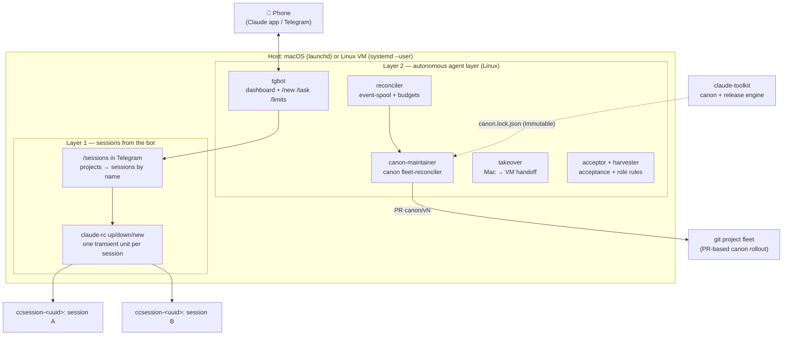

# claude-control

**[Русский](./README.md) · English**

[](https://github.com/dewil/claude-control/actions/workflows/shellcheck.yml)
[](./LICENSE)

Autonomous infrastructure on top of [Claude Code](https://claude.com/claude-code): an always-on control plane that (1) dispatches remote Claude sessions to any of your projects from your phone, and (2) runs a fleet of background agents — with an event spool, budgets, cross-machine handoff, independent-context acceptance, and deterministic canon rollout via pull requests.

> One half of a two-repo system. The other is [**claude-toolkit**](https://github.com/dewil/claude-toolkit): a canon of rules/agents/skills plus a transactional engine that packages it into immutable releases. `claude-control` rolls those releases across the fleet (see [Layer 2 → canon fleet-reconciler](#canon-fleet-reconciler)).

> [!NOTE]
> The core (remote-control) sits on top of the [`claude remote-control`](https://code.claude.com/docs/en/remote-control.md) feature — a **research preview** at the time of writing. Requires Claude Code CLI **≥ 2.1.51** and a Claude-subscription login (`claude /login`); Anthropic API keys do not work for remote-control.

---

## Two layers

The system grew in two layers, each self-contained and installed by a single `install.sh`.



- **Layer 1 — sessions from the bot** (Linux; the CLI works on macOS, but transient units do not). `/sessions` in Telegram: projects -> that project's sessions under their own names -> bring up, put down, start a new one. A raised session lives in a transient `systemd` unit and shows up in the Claude Code app. Access to any repo and to any past session, with no SSH and no manual `cd`.
- **Layer 2 — autonomous agent layer** (Linux/systemd on a VM). Background agents supervised by a reconciler: an event spool, a `/new`-from-phone task loop (worktree, cards, accept by tap), per-run budgets, a circuit breaker, cross-machine takeover, independent role-based acceptance, an operator-feedback harvester, and a deterministic canon fleet-reconciler.

Both layers are **stdlib Python + shell, zero external dependencies**, user-level units only (no `sudo`, no system services), idempotent install/uninstall.

---

## Layer 1 — sessions from the bot

Claude Code can open a session for remote control that you attach to from your phone. On its own that does not close the gap: to enter a project you must physically sit at the machine, `cd` into the repo and run `claude --remote-control`. And to get back into yesterday's conversation you also have to remember which of the dozens it was.

`claude-control` closes both gaps with one screen in Telegram:

- `/sessions` -> the project list from `~/.claude-control/projects.yaml`;
- a project -> its sessions **under the same names you see in Cursor** (`/rename` writes the name into the transcript, the bot reads it from there), raised ones marked with a dot;
- tap a session -> `▶ bring up` / `⏹ put down`; a separate button starts `➕ a new session`.

A raised session appears in the Claude Code app and that is where the work happens. On the host it lives in a **transient systemd unit** `ccsession-<uuid>`: it outlives its caller, gets a cgroup and a memory ceiling, and is stopped by name. There is no always-on dispatcher session and no `tmux` in the design any more.

What it buys you: any project and any past session two taps away, no pre-opened sessions, a single-file project registry. Restoring a past session into the bridge takes a specific trick: `--resume` without a prompt always exits, and without a pty the process runs the prompt and quits without attaching. The write-up is in the [stage contract](./docs/design-2026-08-01-v3-layer1-sessions-on-bot.md).

**From the phone:**

```
You (in Telegram)  - /sessions
Bot                - [claude-control] [проект 1] [проект 2] ...
You                - проект 1
Bot                - ➕ new session
                     ● control-v2      <- raised
                       сессия 1
                       LLM start
You                - сессия 1 -> ▶ bring up
You                - open Claude Code, pick "сессия 1" - you are inside
```

The same from the machine, when the bot is not around:

```sh
claude-rc sessions <project> --porcelain   # uuid, name, whether raised
claude-rc up <project> <uuid>              # bring up
claude-rc new <project>                    # a new empty one
claude-rc down <uuid>                      # put down
claude-rc live                             # what is raised right now
```

---

## Layer 2 — autonomous agent layer

On top of the dispatcher: a fleet of background agents that keep a mission going after you leave the session. Runs on Linux (needs transient units and cgroups from `systemd --user`). Built to a [state-machine contract](./docs/design-2026-07-11-agent-state-machine.md) that separates **spec** (what to do), **control** (armed/budget/latch) and **reconciler** (who drives fact toward desired).

### reconciler + event-spool
The autonomy core. A durable event **spool** (at-least-once with producer idempotency keyed on `update_id`), a headless executor, a **per-run budget** (an agent cannot burn forever), fail-closed on unknown failures (an event must never be lost). See [stage 4 design](./docs/design-2026-07-12-stage4-event-spool.md).

### V2 task loop — `/new` from your phone
On top of the spool: a full task lifecycle with no open session. `/new <project> <text>` in Telegram births a task from a template with a strict permission belt (fail-closed: no valid template — no task), the agent works in a git worktree of the project and files a "done" claim; an acceptance card lands in your DMs, tapping "accept" merges the branch into the project, cleanup and archival are automatic. Eleven stages [V2.0](./docs/design-2026-07-25-v2-runtime-drain.md)–[V2.10](./docs/design-2026-07-28-v2.10-task-actually-works.md), each with its own SDD contract and adversarial audit:

- **Scale-to-zero and memory.** The executor exits on an empty inbox and the reconciler wakes it per event ([V2.0](./docs/design-2026-07-25-v2-runtime-drain.md)); per-agent worktrees and permission belts ([V2.1](./docs/design-2026-07-25-v2.1-workspace-permissions.md)); task thread memory survives across runs ([V2.2](./docs/design-2026-07-26-v2.2-thread-memory.md)).
- **Questions and confirmations** are a durable run outcome, not task death: the agent asks (`claude-agent-ask`) or hits the permission gate, a card with buttons goes to TG, and the tap/reply answer comes back exactly once ([V2.3](./docs/design-2026-07-26-v2.3-question-fsm.md)–[V2.6](./docs/design-2026-07-26-v2.6-reminder-ladder.md)).
- **Acceptance** is a durable FSM `requested -> accepted -> integrated -> cleaned -> archived` with the claim's SHA pinned ([V2.7a](./docs/design-2026-07-26-v2.7a-task-birth-and-done.md), [V2.7b](./docs/design-2026-07-26-v2.7b-acceptance-integration.md)); schedules as an event source ([V2.8](./docs/design-2026-07-27-v2.8-schedule-source.md)); human corrections given mid-task are distilled into project rules ([V2.9](./docs/design-2026-07-27-v2.9-lesson-distillation.md)).
- **The agent has no git.** Three audit rounds found three independent ways to execute agent-authored code before human acceptance via git machinery (hooks, flags like `git log --output=`, clean filters, fsmonitor) — silencing them one by one proved an unwinnable race. Git is removed entirely: the runtime commits, after the done claim ([V2.10](./docs/design-2026-07-28-v2.10-task-actually-works.md)).

### tgbot — fleet dashboard
A long-poll Telegram bot (getUpdates, not webhooks — webhooks are DPI-filtered in some networks). Commands `/agents`, `/agent <name>`, `/new <project> <text>` (birth a task), `/task <name> <text>` (an event for an existing agent), `/menu` and `/limits` (remaining Claude/Codex subscription limits); question and acceptance cards carry inline buttons, answered by tap or reply. Private chats + a `from.id` whitelist; all agent output is untrusted, HTML-escaped and sent as `<pre>`.

### <a id="canon-fleet-reconciler"></a>canon-maintainer — canon fleet-reconciler
Rolls canon revisions from [claude-toolkit](https://github.com/dewil/claude-toolkit) across a fleet of git projects **via pull requests**, deterministically and with no LLM in the data plane. Consumes the toolkit's transactional delta engine (`canon-delta.py`). The densest piece, engineering-wise:

- **Model B**: the reconciler on the VM holds fleet clones; canon travels on a `canon/<vN>` branch + PR; `applied` is recorded only once the canon bytes are present in the post-merge default branch (post-merge truth). Mac checkouts and non-git vaults are never mutated — observe only.
- **Immutable releases**: a revision's identity = the git commit_sha of the annotated tag `canon-vN`; a rejected release (closed PR) is superseded by the next version, never rebuilt.
- **Rollout rings** canary → snapshot → rest, plus a **circuit breaker** (latch on incompat/error/smoke, cleared only by an explicit `ack`).
- **Semantic smoke** of the candidate before push, a per-pass **budget** of applications, **break-glass rollback** to the previous revision, **observe-first** (early passes only watch), and an instant `disarm` kill switch.
- Full [runbook](./docs/runbook-canon-maintainer.md) and [stage 8 design](./docs/design-2026-07-14-stage8-canon-sync.md).

### takeover — cross-machine handoff
Moves a live mission Mac → VM **not by transferring the transcript** (fundamentally unsafe — it would drag along foreign context) but as a fresh, brief-seeded session: a new agent starts on the VM from a self-contained brief anchored at a base commit. [Stage 5 design](./docs/design-2026-07-13-stage5-takeover.md).

### acceptor + harvester — acceptance and the reverse flow
The **acceptor** ([stage 7](./docs/design-2026-07-12-stage7-acceptor-role.md)) is a role-based judge of artifacts in an independent context (deterministic / role-review / both), with a corpus-runner and a confusion matrix for calibration. The **harvester** ([stage 7b](./docs/design-2026-07-13-stage7b-harvester.md)) turns operator edits (revise/reject) into candidate role rules: collect → propose → digest → approve.

### limits-digest — LLM limits digest
Every 15 minutes it reads the remaining Claude/Codex subscription limits (quota metadata, not inference — it does not spend the quota) and pushes a panel to Telegram **only when the numbers change** (dedup by a signature of percentages/statuses; reset times do not count as a change). [Runbook](./docs/runbook-limits-digest.md).

> Stage 6 (a web control panel for the fleet) is still a [design](./docs/design-2026-07-14-stage6-web-panel.md), not an implementation.

---

## Backups (optional)

The `claude-control-backup` module: client-encrypted, deduplicated backup of arbitrary paths to **two independent S3 repositories** via [restic](https://restic.net). Installed with `--with-backup` (Linux).

- **Client-side encryption** - the provider only ever sees ciphertext, so you can keep backups with a host you would not trust with plaintext.
- **Two independent providers** - two `backup` runs (not `copy`); a failure or ban of one does not block the other, and either one restores on its own.
- **Dedup + zstd compression** - typically 5-10x savings on text data.
- **systemd timer** (daily) + **restore drill** - an unverified backup is no backup.

Paths, repo URLs and credentials live in `~/.config/claude-control/backup-env` (outside git, `chmod 600`); nothing machine-specific is in the scripts. Setup and recovery: [docs/runbook-backup.md](docs/runbook-backup.md).

## Engineering decisions and verification

What makes this more than scripts:

- **Determinism in the data plane.** Canon rollout is a pure delta engine over an immutable release descriptor; the LLM comes up only on demand for conflict resolution. Metric: 0 LLM calls on a no-op pass.
- **Transactional safety.** A WAL with a crash matrix (prepare/commit/recovery roll-forward/back), CAS before rename, no-clobber on foreign files, write containment within the project. Proven by fault-injection tests, not "on paper".
- **Autonomy with brakes.** Per-run budgets, a circuit breaker with a durable latch, rollout rings, observe-first, a kill switch. An autonomous agent cannot run away silently.
- **Adversarial verification.** Each major layer goes through several rounds of adversarial review by a **second model** (a different class of bugs than the primary agent finds); every finding is closed with a fix **plus a regression test**. The stack of stages has accumulated dozens of closed blockers; the toolkit's canon engine has ~100 stdlib tests and 4 adversarial rounds to GO.
- **An explicit threat model.** Trusted VM, our durable state, canon from our git mirror; the boundaries (TOCTOU under flock, symlink parents, secret handling) are worked out and documented, residual risks accepted in writing.
- **Zero dependencies, user-level.** Only stdlib Python + shell, only user launchd/systemd units, idempotent install/uninstall.

Per-stage design docs live in [`docs/`](./docs/); the architecture of both layers (including a diagram of the V2 task loop) is in [`docs/architecture.md`](./docs/architecture.md).

---

## Requirements

- Linux with `systemd --user` (Ubuntu 22.04+, Debian 12+) — both layers. On macOS the CLI works (`claude-rc sessions/up/down`), but the session holder is a transient systemd unit, so bringing sessions up does not.
- [Claude Code CLI](https://docs.claude.com/claude-code) ≥ 2.1.51, logged in via `claude /login` (Claude subscription).
- `yq` by mikefarah, v4 — `brew install yq` (macOS); on Linux the **binary from [GitHub releases](https://github.com/mikefarah/yq/releases)** (the apt `yq` is a different project). `install.sh` checks the version.
- macOS: keep the Mac awake while you work remotely (launchd does not tick while asleep). The usual trick is a separate `caffeinate -i` agent; this repo does not install one.
- Linux: enable **lingering** (`loginctl enable-linger $USER`), or user services die on logout. `install.sh` checks and warns.

## Quick start

```sh
git clone https://github.com/dewil/claude-control.git
cd claude-control
./install.sh
$EDITOR ~/.claude-control/projects.yaml   # add your projects
```

Done. Session control lives in the Telegram bot: **`/sessions` -> project -> session -> bring up**; the bot, reconciler, canon-maintainer and limits-digest come up from the same `install.sh` once `~/.config/claude-control/env` has the needed variables (see the runbooks in `docs/`). Without the bot the same actions are available from the machine: `claude-rc sessions <project> --porcelain`, `claude-rc up <project> <uuid>`.

Hacking on the repo itself? Use `./install.sh --link` (scripts in `~/.local/bin/` become symlinks to `bin/`, so `git pull` updates the running code immediately).

## Security

- **`projects.yaml` is a trusted file.** `claude-rc` parses paths through `yq` as data, with no shell interpolation, and validates the project name; the contents are under your control. Do not edit it on an LLM's request from chat.
- **The bot launches nothing itself.** A tap goes into `claude-rc up/down/new`; the project name and the short session id from `callback_data` are rejected unless they match a strict shape, and never reach a shell. Access is private chat plus a `from.id` whitelist.
- **Project sessions inherit your `~/.claude/settings.json`.** `claude-rc` passes nothing on top — if `bypassPermissions` is set, a remote session will silently do whatever is asked. Want otherwise? Add a per-project `.claude/settings.local.json` with an explicit allow-list.
- **Prompt injection.** Text from READMEs, branch names and other files is data, not instructions. A session's own name comes from the transcript and counts as data too: it is escaped on its way into a button or card, and `%q`-quoted on its way into a command line.
- **The agent layer** — private chats + a Telegram whitelist, budgets and a circuit breaker against runaway, secrets only in env files (never in the repo/chat).
- **V2 task agents have no git.** They work in a worktree under a strict template-defined permission belt (fail-closed: no valid template — no task is born); the runtime does the committing, and nothing reaches the project's default branch until a human explicitly accepts.

## Structure

Layer 1 (dispatcher):
- [`bin/claude-rc`](./bin/claude-rc) — `sessions --porcelain`, `up`, `new`, `down`, `live`: the named session list and bringing one up in a transient unit.
- [`bin/claude-agent-tgbot`](./bin/claude-agent-tgbot) — the `/sessions` screen (also the agent dashboard, see Layer 2).
- [`bin/claude-control-session`](./bin/claude-control-session) — legacy entrypoint of the always-on control session; the installer no longer enables it and disables it on machines that already have it.
- [`bin/claude-control-watchdog`](./bin/claude-control-watchdog), [`claude-control-project-watchdog`](./bin/claude-control-project-watchdog) — session liveness.

Layer 2 (agent):
- [`bin/claude-agent-reconciler`](./bin/claude-agent-reconciler) — the autonomous-agent reconciler.
- [`bin/claude-agent-run`](./bin/claude-agent-run), [`claude-agent-io`](./bin/claude-agent-io), [`claude-agent-session`](./bin/claude-agent-session) — agent execution/spool/sessions.
- [`bin/claude-agent-tgbot`](./bin/claude-agent-tgbot) — the Telegram dashboard (`/agents`, `/new`, `/task`, `/limits`, question and acceptance cards).
- [`bin/claude-agent-done`](./bin/claude-agent-done), [`claude-agent-ask`](./bin/claude-agent-ask), [`claude-agent-answer`](./bin/claude-agent-answer), [`claude-agent-permit`](./bin/claude-agent-permit) — the V2 task protocol: the "done" claim, mid-run questions, the trusted answer writer, the confirmation gate.
- [`bin/claude-agent-canon-maintainer`](./bin/claude-agent-canon-maintainer) — the canon fleet-reconciler.
- [`bin/claude-agent-limits-digest`](./bin/claude-agent-limits-digest) — the LLM limits digest.
- [`bin/claude-agent-harvest`](./bin/claude-agent-harvest), [`claude-agent-review`](./bin/claude-agent-review), [`claude-agent-checkrun`](./bin/claude-agent-checkrun) — acceptance/review/checks.
- [`bin/claude-rc-takeover`](./bin/claude-rc-takeover), [`claude-rc-agent`](./bin/claude-rc-agent) — cross-machine takeover.

Optional module (`--with-backup`):
- [`bin/claude-control-backup`](./bin/claude-control-backup), [`claude-control-backup-init`](./bin/claude-control-backup-init), [`claude-control-backup-restore-test`](./bin/claude-control-backup-restore-test) — restic backup to two S3 providers (see [runbook](./docs/runbook-backup.md)).

Shared:
- [`launchd/`](./launchd/) / [`systemd/`](./systemd/) — unit templates; `install.sh` renders them.
- [`examples/`](./examples/) — starter `projects.yaml`, `CLAUDE.md`, `settings.local.json`.
- [`docs/`](./docs/) — `architecture.md`, per-stage design docs, runbooks (canon-maintainer, limits-digest), troubleshooting.
- [`tests/`](./tests/) — offline tests for agent-layer components.
- [`install.sh`](./install.sh) / [`uninstall.sh`](./uninstall.sh).

## Principles

- **Idempotency** — `install.sh` is re-runnable; `projects.yaml`, `CLAUDE.md`, logs are left alone.
- **Runtime separate from the repo** — code wherever is convenient (`~/Work/claude-control/`), data in `~/.claude-control/`.
- **User-level supervisor only** — launchd user agent / `systemctl --user`, no `sudo`.
- **No magic in supervision** — the watchdog reads the log and kicks the supervisor; everything is visible in `~/.claude-control/*.log`.

## Uninstall

```sh
./uninstall.sh           # remove agents, delete scripts from ~/.local/bin/
./uninstall.sh --purge   # also remove ~/.claude-control/
```

## License

[MIT](./LICENSE). Take it, adapt it, use it — just keep the copyright notice in derivatives.
