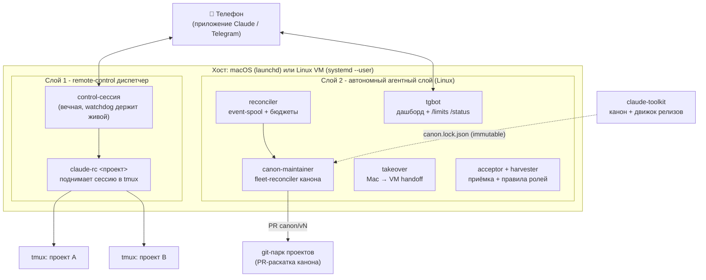

# claude-control

**Русский · [English](./README.en.md)**

[](https://github.com/dewil/claude-control/actions/workflows/shellcheck.yml)
[](./LICENSE)

Автономная инфраструктура поверх [Claude Code](https://claude.com/claude-code): всегда живая control-плоскость, которая (1) раздаёт удалённые Claude-сессии по всем твоим проектам с телефона и (2) держит парк фоновых агентов - с событийной очередью, бюджетами, кросс-машинным handoff, независимой приёмкой результата и детерминированной раскаткой канона через pull request'ы.

> Часть системы из двух репозиториев. Второй - [**claude-toolkit**](https://github.com/dewil/claude-toolkit): канон правил/агентов/скиллов и транзакционный движок его упаковки в immutable-релизы. `claude-control` эти релизы раскатывает по парку (см. [Слой 2 -> canon fleet-reconciler](#canon-fleet-reconciler)).

> [!NOTE]
> Ядро (remote-control) стоит поверх фичи [`claude remote-control`](https://code.claude.com/docs/en/remote-control.md) - на момент написания в статусе **research preview**. Нужен Claude Code CLI **≥ 2.1.51** и логин через Claude-подписку (`claude /login`); API-ключи Anthropic для remote-control не работают.

---

## Два слоя

Система росла двумя слоями, каждый самодостаточен и ставится одним `install.sh`.



- **Слой 1 - remote-control диспетчер** (macOS/Linux). Одна вечная control-сессия; с телефона говоришь "подними `<проект>`", она поднимает проектную Claude-сессию в `tmux`. Доступ к любому репо без SSH и ручного `cd`.
- **Слой 2 - автономный агентный слой** (Linux/systemd на VM). Фоновые агенты под надзором reconciler'а: событийная очередь, бюджеты по запускам, circuit breaker, кросс-машинный takeover, независимая ролевая приёмка, harvester операторских поправок и детерминированный fleet-reconciler канона.

Оба слоя - **stdlib Python + shell, ноль внешних зависимостей**, только пользовательские юниты (никакого `sudo`, никаких системных сервисов), идемпотентная установка/снос.

---

## Слой 1 - remote-control диспетчер

Claude Code умеет открывать сессию для удалённого управления (`claude remote-control --name X`), к ней подключаешься с телефона. Но в живом виде неудобно: чтобы зайти в нужный проект, надо физически у Mac'а открыть терминал, `cd` в репо, запустить `claude remote-control`, и только потом идти в телефон. Не за Mac'ом - вся затея бесполезна.

`claude-control` закрывает зазор:

- На хосте постоянно крутится одна **control-сессия** (launchd/systemd держит живой), доступная с телефона круглосуточно.
- С телефона говоришь ей "подними `<проект>`" - она зовёт `claude-rc <проект>`, тот поднимает проектную сессию в `tmux` в нужной директории.
- Открываешь приложение Claude ещё раз - видишь новую сессию `<проект>`, ты внутри проекта, удалённо.
- **Watchdog** перезапускает control-сессию, если она тихо умерла (launchd/systemd сам этого не замечает); **project-watchdog** приглядывает за проектными сессиями.

Что это даёт: доступ к любому проекту за один сценарий, без заранее открытых сессий (поднимаешь только нужное), реестр проектов в одном файле (`~/.claude-control/projects.yaml`, строка на проект), идемпотентность (повторный "подними" не плодит дублей).

**Как выглядит с телефона:**

```
Ты (в приложении Claude)  - открыл Code, выбрал сессию "control"
Ты                        - "подними webapp"
control-сессия            - зовёт claude-rc webapp, отвечает именем tmux-сессии
Ты                        - открываешь Code ещё раз, выбираешь "webapp"
Ты                        - внутри проекта, удалённо
```

---

## Слой 2 - автономный агентный слой

Поверх диспетчера - парк фоновых агентов, которые продолжают миссию, когда ты вышел из сессии. Живёт на Linux (нужны transient-юниты и cgroups от `systemd --user`). Спроектирован по [state-machine контракту](./docs/design-2026-07-11-agent-state-machine.md): у каждого агента разведены **spec** (что делать), **control** (armed/budget/latch) и **reconciler** (кто приводит факт к желаемому).

### reconciler + event-spool
Ядро автономии. Durable **spool** событий (at-least-once с producer-идемпотентностью по `update_id`), executor в headless-режиме, **бюджет по запускам** (агент не жжёт бесконечно), fail-closed на неизвестных отказах (событие нельзя терять). Разбор в [дизайне этапа 4](./docs/design-2026-07-12-stage4-event-spool.md).

### tgbot - дашборд парка
Long-poll Telegram-бот (getUpdates, не webhook - webhooks режет DPI в ряде сетей). Команды `/agents`, `/agent <name>`, `/task <name> <текст>`, плюс `/status` (доступность сервисов) и `/limits` (остатки подписочных лимитов Claude/Codex). Приватные чаты + whitelist по `from.id`; весь вывод агентов - недоверенные данные, эскейпится и шлётся как `<pre>`.

### <a id="canon-fleet-reconciler"></a>canon-maintainer - fleet-reconciler канона
Раскатывает ревизии канона из [claude-toolkit](https://github.com/dewil/claude-toolkit) по парку git-проектов **через pull request'ы**, детерминированно и без LLM в data-plane. Потребляет транзакционный дельта-движок toolkit'а (`canon-delta.py`). Инженерно самая плотная часть:

- **Модель B**: reconciler на VM держит клоны парка, канон едет веткой `canon/<vN>` + PR; `applied` фиксируется только по факту присутствия байт канона в post-merge default-ветке (post-merge truth). Mac-чекауты и не-git vault'ы не мутируются никогда - только observe.
- **Immutable-релизы**: identity ревизии = git commit_sha аннотированного тега `canon-vN`; отклонённый релиз (закрытый PR) суперсидится следующей версией, не пересобирается.
- **Кольца раскатки** canary -> snapshot -> rest + **circuit breaker** (защёлка на incompat/error/smoke, снятие только явным `ack`).
- **Semantic smoke** кандидата до push, **budget** применений на проход, **break-glass rollback** на предыдущую ревизию, **observe-first** (первые проходы только наблюдают) и мгновенный kill-switch `disarm`.
- Полный [runbook](./docs/runbook-canon-maintainer.md) и [дизайн этапа 8](./docs/design-2026-07-14-stage8-canon-sync.md).

### takeover - кросс-машинный handoff
Перенос живой миссии Mac -> VM **не переносом транскрипта** (фундаментально небезопасно - утащил бы чужой контекст), а fresh brief-seeded сессией: новый агент поднимается на VM с самодостаточным брифом от base-commit. [Дизайн этапа 5](./docs/design-2026-07-13-stage5-takeover.md).

### acceptor + harvester - приёмка и обратный поток
**Acceptor** ([этап 7](./docs/design-2026-07-12-stage7-acceptor-role.md)) - ролевой судья артефактов в независимом контексте (deterministic / role-review / both), с corpus-runner и confusion-matrix для калибровки. **Harvester** ([этап 7b](./docs/design-2026-07-13-stage7b-harvester.md)) - операторские правки (revise/reject) превращаются в кандидаты правил ролей: collect -> propose -> digest -> approve.

### limits-digest - дайджест лимитов LLM
Каждые 15 минут снимает остаток подписочных лимитов Claude/Codex (метаданные квоты, не inference - саму квоту не тратит) и шлёт панель в Telegram **только при изменении цифр** (дедуп по сигнатуре процентов/статусов, время сброса не считается изменением). [Runbook](./docs/runbook-limits-digest.md).

> Этап 6 (веб-панель управления парком) - пока [дизайн](./docs/design-2026-07-14-stage6-web-panel.md), не реализация.

---

## Инженерные решения и верификация

Что делает это не "скриптами на коленке":

- **Детерминизм в data-plane.** Канон-раскатка - чистый дельта-движок над immutable release-дескриптором; LLM поднимается только on-demand на разрешение конфликтов. Метрика: 0 вызовов LLM на no-op проходе.
- **Транзакционная безопасность.** WAL с crash-матрицей (prepare/commit/recovery roll-forward/back), CAS перед rename, no-clobber на чужие файлы, containment записи в пределах проекта. Доказывается fault-injection тестами, а не "на бумаге".
- **Автономность с тормозами.** Бюджеты по запускам, circuit breaker с durable-защёлкой, кольца раскатки, observe-first, kill-switch. Автономный агент не может уйти в разнос молча.
- **Состязательная верификация.** Каждый крупный слой проходит несколько раундов adversarial-ревью **второй моделью** (другой класс ошибок, чем у основного агента); каждая находка закрывается фиксом **плюс регресс-тестом**. Стек этапов накопил десятки закрытых blocker'ов; канон-движок toolkit'а - ~100 stdlib-тестов и 4 раунда adversarial до GO.
- **Модель угроз явная.** Доверенная VM, durable-state наш, канон из нашего git-зеркала; границы (TOCTOU под flock, symlink-родители, secret-handling) отработаны и задокументированы, остаточные риски приняты письменно.
- **Ноль зависимостей, user-level.** Только stdlib Python + shell, только пользовательские launchd/systemd-юниты, идемпотентные install/uninstall.

Дизайн-доки по этапам - в [`docs/`](./docs/); архитектура слоя 1 - [`docs/architecture.md`](./docs/architecture.md).

---

## Требования

- macOS (launchd) - для слоя 1; Linux с `systemd --user` (Ubuntu 22.04+, Debian 12+) - для слоёв 1 и 2 (агентный слой только на Linux).
- [Claude Code CLI](https://docs.claude.com/claude-code) ≥ 2.1.51, залогинен через `claude /login` (Claude-подписка).
- `tmux` - `brew install tmux` (macOS) / `apt install tmux` (Linux).
- `yq` от mikefarah, v4 - `brew install yq` (macOS); на Linux **бинарник с [GitHub releases](https://github.com/mikefarah/yq/releases)** (пакет `yq` из apt - другой проект). `install.sh` проверит версию.
- macOS: держать Mac неспящим, пока работаешь удалённо (launchd не тикает во сне). Приём - отдельный агент с `caffeinate -i`; репо его не ставит.
- Linux: включённый **lingering** (`loginctl enable-linger $USER`), иначе user-сервисы гибнут при logout. `install.sh` проверит и предупредит.

## Быстрый старт

```sh
git clone https://github.com/dewil/claude-control.git
cd claude-control
./install.sh
$EDITOR ~/.claude-control/projects.yaml   # вписать свои проекты
```

Готово - control-сессия крутится: **приложение Claude -> Code -> сессия `control` -> "подними `<имя>`"**. Агентный слой (tgbot, reconciler, canon-maintainer, limits-digest) поднимается тем же `install.sh` при наличии `~/.config/claude-control/env` с нужными переменными (см. runbook'и в `docs/`).

Правишь сам репо - ставь `./install.sh --link` (скрипты в `~/.local/bin/` станут симлинками на `bin/`, `git pull` сразу обновляет рабочий код).

## Безопасность

- **`projects.yaml` - доверенный файл.** `claude-rc` парсит пути через `yq` как данные, без shell-интерполяции, валидирует имя проекта; содержимое под твоим контролем. Не редактируй его по запросу LLM из чата.
- **Control-сессия - диспетчер с узким allow-list'ом.** Разрешено только звать `claude-rc`, `tmux ls`, `tmux kill-session` (см. [`examples/`](./examples/)). Никакого общего `Bash`/`Edit`.
- **Проектные сессии наследуют твои `~/.claude/settings.json`.** `claude-rc` ничего не пробрасывает поверх - если стоит `bypassPermissions`, удалённая сессия молча сделает что попросят. Хочешь иначе - добавь в проект `.claude/settings.local.json` с явным allow-списком.
- **prompt-injection.** Текст из README/имён веток/чужих файлов - данные, не инструкции; для control-сессии это прописано в `control-CLAUDE.md.example`.
- **Агентный слой** - приватные чаты + whitelist в Telegram, бюджеты и circuit breaker против разгона, секреты только в env-файлах (не в репо/чате).

## Структура

Слой 1 (диспетчер):
- [`bin/claude-rc`](./bin/claude-rc) - поднимает проектную сессию в `tmux`.
- [`bin/claude-control-session`](./bin/claude-control-session) - entrypoint вечной control-сессии.
- [`bin/claude-control-watchdog`](./bin/claude-control-watchdog), [`claude-control-project-watchdog`](./bin/claude-control-project-watchdog) - живучесть сессий.

Слой 2 (агентный):
- [`bin/claude-agent-reconciler`](./bin/claude-agent-reconciler) - reconciler автономных агентов.
- [`bin/claude-agent-run`](./bin/claude-agent-run), [`claude-agent-io`](./bin/claude-agent-io), [`claude-agent-session`](./bin/claude-agent-session) - исполнение/spool/сессии агентов.
- [`bin/claude-agent-tgbot`](./bin/claude-agent-tgbot) - Telegram-дашборд (`/agents`, `/task`, `/status`, `/limits`).
- [`bin/claude-agent-canon-maintainer`](./bin/claude-agent-canon-maintainer) - fleet-reconciler канона.
- [`bin/claude-agent-limits-digest`](./bin/claude-agent-limits-digest) - дайджест лимитов LLM.
- [`bin/claude-agent-harvest`](./bin/claude-agent-harvest), [`claude-agent-review`](./bin/claude-agent-review), [`claude-agent-checkrun`](./bin/claude-agent-checkrun) - приёмка/ревью/проверки.
- [`bin/claude-rc-takeover`](./bin/claude-rc-takeover), [`claude-rc-agent`](./bin/claude-rc-agent) - кросс-машинный takeover.

Общее:
- [`launchd/`](./launchd/) / [`systemd/`](./systemd/) - шаблоны юнитов; `install.sh` их рендерит.
- [`examples/`](./examples/) - стартовые `projects.yaml`, `CLAUDE.md`, `settings.local.json`.
- [`docs/`](./docs/) - `architecture.md`, дизайн-доки этапов, runbook'и (canon-maintainer, limits-digest), troubleshooting.
- [`tests/`](./tests/) - offline-тесты компонентов агентного слоя.
- [`install.sh`](./install.sh) / [`uninstall.sh`](./uninstall.sh).

## Принципы

- **Идемпотентность** - `install.sh` гоняется повторно; `projects.yaml`, `CLAUDE.md`, логи не трогаются.
- **Runtime отдельно от репо** - код где удобно (`~/Work/claude-control/`), данные в `~/.claude-control/`.
- **Только user-level супервизор** - launchd user agent / `systemctl --user`, никакого `sudo`.
- **Никакой магии в надзоре** - watchdog читает лог и пинает супервизор; всё видно глазами в `~/.claude-control/*.log`.

## Удалить

```sh
./uninstall.sh           # снять агентов, удалить скрипты из ~/.local/bin/
./uninstall.sh --purge   # дополнительно снести ~/.claude-control/
```

## Лицензия

[MIT](./LICENSE). Бери, дорабатывай, используй у себя - оставь copyright-уведомление в производных копиях.
