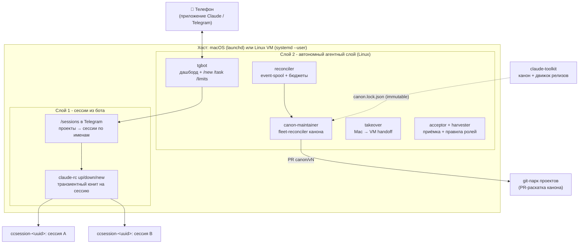

# claude-control

**Русский · [English](./README.en.md)**

[](https://github.com/dewil/claude-control/actions/workflows/shellcheck.yml)
[](./LICENSE)

Автономная инфраструктура поверх [Claude Code](https://claude.com/claude-code): control-плоскость в Telegram, которая (1) раздаёт с телефона удалённые Claude-сессии по всем твоим проектам - включая возврат в любую прошлую сессию по её имени - и (2) держит парк фоновых агентов - с событийной очередью, бюджетами, кросс-машинным handoff, независимой приёмкой результата и детерминированной раскаткой канона через pull request'ы.

> Часть системы из двух репозиториев. Второй - [**claude-toolkit**](https://github.com/dewil/claude-toolkit): канон правил/агентов/скиллов и транзакционный движок его упаковки в immutable-релизы. `claude-control` эти релизы раскатывает по парку (см. [Слой 2 -> canon fleet-reconciler](#canon-fleet-reconciler)).

> [!NOTE]
> Ядро (remote-control) стоит поверх фичи [`claude remote-control`](https://code.claude.com/docs/en/remote-control.md) - на момент написания в статусе **research preview**. Нужен Claude Code CLI **≥ 2.1.51** и логин через Claude-подписку (`claude /login`); API-ключи Anthropic для remote-control не работают.

---

## Два слоя

Система росла двумя слоями, каждый самодостаточен и ставится одним `install.sh`.



- **Слой 1 - сессии из бота** (Linux; на macOS доступен CLI, но без транзиентных юнитов). В Telegram `/sessions`: проекты -> сессии проекта под их собственными именами -> поднять, положить, создать новую. Поднятая сессия живёт транзиентным `systemd`-юнитом и появляется в приложении Claude Code. Доступ к любому репо и к любой прошлой сессии без SSH и ручного `cd`.
- **Слой 2 - автономный агентный слой** (Linux/systemd на VM). Фоновые агенты под надзором reconciler'а: событийная очередь, контур задач `/new` с телефона (worktree, карточки, приёмка тапом), бюджеты по запускам, circuit breaker, кросс-машинный takeover, независимая ролевая приёмка, harvester операторских поправок и детерминированный fleet-reconciler канона.

Оба слоя - **stdlib Python + shell, ноль внешних зависимостей**, только пользовательские юниты (никакого `sudo`, никаких системных сервисов), идемпотентная установка/снос.

---

## Слой 1 - сессии из бота

Claude Code умеет открывать сессию для удалённого управления, к ней подключаешься с телефона. Но сам по себе он этого не закрывает: чтобы попасть в нужный репозиторий, надо физически сесть за машину, `cd` в проект и запустить `claude --remote-control`. А чтобы вернуться во вчерашний разговор - ещё и вспомнить, какой именно из десятков это был.

`claude-control` закрывает оба зазора одним экраном в Telegram:

- `/sessions` -> список проектов из `~/.claude-control/projects.yaml`;
- проект -> его сессии **под теми же именами, что видны в Cursor** (`/rename` пишет имя в транскрипт, бот читает оттуда же), у поднятых - кружок;
- тап по сессии -> `▶ поднять` / `⏹ положить`; отдельной кнопкой - `➕ новая сессия`.

Поднятая сессия появляется в приложении Claude Code, и дальше работа идёт там. На хосте она живёт **транзиентным systemd-юнитом** `ccsession-<uuid>`: переживает выход вызывающего, получает cgroup и потолок памяти, гасится по имени. Никакой постоянно живущей сессии-диспетчера и никакого `tmux` в схеме больше нет.

Что это даёт: доступ к любому проекту и к любой прошлой сессии за два тапа, без заранее открытых сессий, с реестром проектов в одном файле. Восстановление прошлой сессии в мост - отдельный трюк: `--resume` без промпта выходит всегда, а без pty процесс отрабатывает промпт и завершается, не подключившись. Разбор - в [контракте этапа](./docs/design-2026-08-01-v3-layer1-sessions-on-bot.md).

**Как выглядит с телефона:**

```
Ты (в Telegram)  - /sessions
Бот              - [claude-control] [проект 1] [проект 2] ...
Ты               - проект 1
Бот              - ➕ новая сессия
                   ● control-v2      ← поднята
                     сессия 1
                     LLM start
Ты               - сессия 1 -> ▶ поднять
Ты               - открываешь Claude Code, выбираешь "сессия 1" - ты внутри
```

То же с машины, если бот недоступен:

```sh
claude-rc sessions <проект> --porcelain   # uuid, имя, поднята ли
claude-rc up <проект> <uuid>              # поднять
claude-rc new <проект>                    # новая пустая
claude-rc down <uuid>                     # положить
claude-rc live                            # что поднято сейчас
claude-rc reap [--dry-run]                # погасить зомби: юнит жив, а мост снесен
```

Зомби заводится, когда карточку сессии архивируют в браузере: CLI сносит мост, а
процесс остается жить - сессия выглядит работающей, хотя достучаться до нее уже
нельзя. Руками звать не нужно: жнец висит вторым `ExecStart` в юните watchdog и
проходит раз в две минуты. Команда пригодится, чтобы посмотреть глазами -
`--dry-run` только докладывает, ничего не гася.

---

## Слой 2 - автономный агентный слой

Поверх диспетчера - парк фоновых агентов, которые продолжают миссию, когда ты вышел из сессии. Живёт на Linux (нужны transient-юниты и cgroups от `systemd --user`). Спроектирован по [state-machine контракту](./docs/design-2026-07-11-agent-state-machine.md): у каждого агента разведены **spec** (что делать), **control** (armed/budget/latch) и **reconciler** (кто приводит факт к желаемому).

### reconciler + event-spool
Ядро автономии. Durable **spool** событий (at-least-once с producer-идемпотентностью по `update_id`), executor в headless-режиме, **бюджет по запускам** (агент не жжёт бесконечно), fail-closed на неизвестных отказах (событие нельзя терять). Разбор в [дизайне этапа 4](./docs/design-2026-07-12-stage4-event-spool.md).

### Контур задач V2 - `/new` с телефона
Поверх spool'а - полный жизненный цикл задачи без открытой сессии: `/new <проект> <текст>` в Telegram рождает задачу из шаблона со строгим поясом прав (fail-closed: нет валидного шаблона - нет задачи), агент работает в git-worktree проекта и заявляет о готовности; карточка приёмки прилетает в личку, тап "принять" мержит ветку в проект, уборка и архив - автоматически. Одиннадцать этапов [V2.0](./docs/design-2026-07-25-v2-runtime-drain.md)-[V2.10](./docs/design-2026-07-28-v2.10-task-actually-works.md), каждый со своим SDD-контрактом и adversarial-аудитом:

- **Scale-to-zero и память.** Executor гаснет на пустом inbox, reconciler будит по событию ([V2.0](./docs/design-2026-07-25-v2-runtime-drain.md)); worktree и пояса прав per-agent ([V2.1](./docs/design-2026-07-25-v2.1-workspace-permissions.md)); тред-память задачи переживает прогоны ([V2.2](./docs/design-2026-07-26-v2.2-thread-memory.md)).
- **Вопросы и подтверждения** - durable-исход прогона, не смерть задачи: агент спрашивает (`claude-agent-ask`) или упирается в гейт прав, карточка с кнопками уезжает в TG, ответ тапом/reply-ем возвращается ровно один раз ([V2.3](./docs/design-2026-07-26-v2.3-question-fsm.md)-[V2.6](./docs/design-2026-07-26-v2.6-reminder-ladder.md)).
- **Приёмка** - durable FSM `requested -> accepted -> integrated -> cleaned -> archived` с фиксацией SHA заявки ([V2.7a](./docs/design-2026-07-26-v2.7a-task-birth-and-done.md), [V2.7b](./docs/design-2026-07-26-v2.7b-acceptance-integration.md)); расписание как источник событий ([V2.8](./docs/design-2026-07-27-v2.8-schedule-source.md)); поправки человека по ходу задачи дистиллируются в правила проекта ([V2.9](./docs/design-2026-07-27-v2.9-lesson-distillation.md)).
- **У агента нет git.** Три круга аудита нашли три независимых способа исполнить код агента до человеческой приёмки через git-механизмы (хуки, флаги вроде `git log --output=`, clean-фильтры, fsmonitor) - глушить их по одному оказалось невыигрываемой гонкой. Git отобран целиком: коммитит рантайм, после заявки о готовности ([V2.10](./docs/design-2026-07-28-v2.10-task-actually-works.md)).

### tgbot - дашборд парка
Long-poll Telegram-бот (getUpdates, не webhook - webhooks режет DPI в ряде сетей). Команды `/agents`, `/agent <name>`, `/new <проект> <текст>` (родить задачу), `/task <name> <текст>` (событие существующему агенту), `/menu` и `/limits` (остатки подписочных лимитов Claude/Codex); карточки вопросов и приёмки - с inline-кнопками, ответ тапом или reply-ем. Приватные чаты + whitelist по `from.id`; весь вывод агентов - недоверенные данные, эскейпится и шлётся как `<pre>`.

### <a id="canon-fleet-reconciler"></a>canon-maintainer - fleet-reconciler канона
Раскатывает ревизии канона из [claude-toolkit](https://github.com/dewil/claude-toolkit) по парку git-проектов **через pull request'ы**, детерминированно и без LLM в data-plane. Потребляет транзакционный дельта-движок toolkit'а (`canon-delta.py`). Инженерно самая плотная часть:

- **Модель B**: reconciler на VM держит клоны парка, канон едет веткой `canon/<vN>` + PR; `applied` фиксируется только по факту присутствия байт канона в post-merge default-ветке (post-merge truth). Mac-чекауты и не-git vault'ы не мутируются никогда - только observe.
- **Immutable-релизы**: identity ревизии = git commit_sha аннотированного тега `canon-vN`; отклонённый релиз (закрытый PR) суперсидится следующей версией, не пересобирается.
- **Кольца раскатки** canary -> snapshot -> rest + **circuit breaker** (защёлка на incompat/error/smoke, снятие только явным `ack`).
- **Semantic smoke** кандидата до push, **budget** применений на проход, **break-glass rollback** на предыдущую ревизию, **observe-first** (первые проходы только наблюдают) и мгновенный kill-switch `disarm`.
- Полный [runbook](./docs/runbook-canon-maintainer.md) и [дизайн этапа 8](./docs/design-2026-07-14-stage8-canon-sync.md).

### takeover - кросс-машинный handoff
Перенос живой миссии Mac -> VM **не переносом транскрипта** (фундаментально небезопасно - утащил бы чужой контекст), а fresh brief-seeded сессией: новый агент поднимается на VM с самодостаточным брифом от base-commit. [Дизайн этапа 5](./docs/design-2026-07-13-stage5-takeover.md).

### acceptor + harvester - приёмка и обратный поток
**Acceptor** ([этап 7](./docs/design-2026-07-12-stage7-acceptor-role.md)) - ролевой судья артефактов в независимом контексте (deterministic / role-review / both), с corpus-runner и confusion-matrix для калибровки. **Harvester** ([этап 7b](./docs/design-2026-07-13-stage7b-harvester.md)) - операторские правки (revise/reject) превращаются в кандидаты правил ролей: collect -> propose -> digest -> approve.

### limits-digest - дайджест лимитов LLM
Каждые 15 минут снимает остаток подписочных лимитов Claude/Codex (метаданные квоты, не inference - саму квоту не тратит) и шлёт панель в Telegram **только при изменении цифр** (дедуп по сигнатуре процентов/статусов, время сброса не считается изменением). [Runbook](./docs/runbook-limits-digest.md).

> Этап 6 (веб-панель управления парком) - пока [дизайн](./docs/design-2026-07-14-stage6-web-panel.md), не реализация.

---

## Резервные копии (опционально)

Модуль `claude-control-backup`: клиентски-шифрованный дедуплицированный бэкап произвольных путей в **два независимых S3-репозитория** через [restic](https://restic.net). Ставится флагом `--with-backup` (Linux).

- **Клиентское шифрование** - провайдер видит только шифртекст, поэтому бэкап можно держать у хостинга, которому не доверяешь plaintext.
- **Два независимых провайдера** - два `backup` (не `copy`); падение или бан одного не мешает второму, восстановление возможно из любого.
- **Дедуп + zstd-сжатие** - на текстовых данных обычно 5-10x экономии.
- **systemd-таймер** (ежедневно) + **restore-drill** - непроверенный бэкап не считается бэкапом.

Пути, URL репозиториев и креды - в `~/.config/claude-control/backup-env` (вне git, `chmod 600`); в скриптах ничего машино-специфичного. Настройка и восстановление - в [docs/runbook-backup.md](docs/runbook-backup.md).

## Инженерные решения и верификация

Что делает это не "скриптами на коленке":

- **Детерминизм в data-plane.** Канон-раскатка - чистый дельта-движок над immutable release-дескриптором; LLM поднимается только on-demand на разрешение конфликтов. Метрика: 0 вызовов LLM на no-op проходе.
- **Транзакционная безопасность.** WAL с crash-матрицей (prepare/commit/recovery roll-forward/back), CAS перед rename, no-clobber на чужие файлы, containment записи в пределах проекта. Доказывается fault-injection тестами, а не "на бумаге".
- **Автономность с тормозами.** Бюджеты по запускам, circuit breaker с durable-защёлкой, кольца раскатки, observe-first, kill-switch. Автономный агент не может уйти в разнос молча.
- **Состязательная верификация.** Каждый крупный слой проходит несколько раундов adversarial-ревью **второй моделью** (другой класс ошибок, чем у основного агента); каждая находка закрывается фиксом **плюс регресс-тестом**. Стек этапов накопил десятки закрытых blocker'ов; канон-движок toolkit'а - ~100 stdlib-тестов и 4 раунда adversarial до GO.
- **Модель угроз явная.** Доверенная VM, durable-state наш, канон из нашего git-зеркала; границы (TOCTOU под flock, symlink-родители, secret-handling) отработаны и задокументированы, остаточные риски приняты письменно.
- **Ноль зависимостей, user-level.** Только stdlib Python + shell, только пользовательские launchd/systemd-юниты, идемпотентные install/uninstall.

Дизайн-доки по этапам - в [`docs/`](./docs/); архитектура обоих слоёв (со схемой контура задач V2) - [`docs/architecture.md`](./docs/architecture.md).

---

## Требования

- Linux с `systemd --user` (Ubuntu 22.04+, Debian 12+) - оба слоя. На macOS доступен CLI (`claude-rc sessions/up/down`), но держатель сессий - транзиентный systemd-юнит, поэтому подъём сессий там не работает.
- [Claude Code CLI](https://docs.claude.com/claude-code) ≥ 2.1.51, залогинен через `claude /login` (Claude-подписка).
- `yq` от mikefarah, v4 - `brew install yq` (macOS); на Linux **бинарник с [GitHub releases](https://github.com/mikefarah/yq/releases)** (пакет `yq` из apt - другой проект). `install.sh` проверит версию.
- Linux: включённый **lingering** (`loginctl enable-linger $USER`), иначе user-сервисы гибнут при logout. `install.sh` проверит и предупредит.

## Быстрый старт

```sh
git clone https://github.com/dewil/claude-control.git
cd claude-control
./install.sh
$EDITOR ~/.claude-control/projects.yaml   # вписать свои проекты
```

Готово. Управление сессиями живёт в Telegram-боте: **`/sessions` -> проект -> сессия -> поднять**; бот, reconciler, canon-maintainer и limits-digest поднимаются тем же `install.sh` при наличии `~/.config/claude-control/env` с нужными переменными (см. runbook'и в `docs/`). Без бота те же действия доступны с машины: `claude-rc sessions <проект> --porcelain`, `claude-rc up <проект> <uuid>`.

Правишь сам репо - ставь `./install.sh --link` (скрипты в `~/.local/bin/` станут симлинками на `bin/`, `git pull` сразу обновляет рабочий код).

## Безопасность

- **`projects.yaml` - доверенный файл.** `claude-rc` парсит пути через `yq` как данные, без shell-интерполяции, валидирует имя проекта; содержимое под твоим контролем. Не редактируй его по запросу LLM из чата.
- **Бот не запускает ничего сам.** Тап уходит в `claude-rc up/down/new`; имя проекта и короткий id сессии из `callback_data` отбиваются строгой формой до вызова, в shell не попадают. Доступ - приватный чат плюс whitelist по `from.id`.
- **Поднятые сессии наследуют твои `~/.claude/settings.json`.** `claude-rc` ничего не пробрасывает поверх - если стоит `bypassPermissions`, удалённая сессия молча сделает что попросят. Хочешь иначе - добавь в проект `.claude/settings.local.json` с явным allow-списком.
- **prompt-injection.** Текст из README, имён веток и чужих файлов - данные, не инструкции. Имя сессии приходит из транскрипта и тоже считается данными: в кнопку и карточку оно уходит экранированным, а в командную строку - через `%q`.
- **Агентный слой** - приватные чаты + whitelist в Telegram, бюджеты и circuit breaker против разгона, секреты только в env-файлах (не в репо/чате).
- **Task-агенты (V2) не имеют git.** Работают в worktree со строгим поясом прав из шаблона (fail-closed: нет валидного шаблона - задача не заводится); коммитит рантайм, в default-ветку проекта результат попадает только после явной приёмки человеком.

## Структура

Слой 1 (сессии):
- [`bin/claude-rc`](./bin/claude-rc) - `sessions --porcelain`, `up`, `new`, `down`, `live`: список сессий с именами и подъём транзиентным юнитом.
- [`bin/claude-agent-tgbot`](./bin/claude-agent-tgbot) - экран `/sessions` (он же дашборд агентов, см. слой 2).
- [`bin/claude-control-session`](./bin/claude-control-session), [`claude-control-watchdog`](./bin/claude-control-watchdog), [`claude-control-project-watchdog`](./bin/claude-control-project-watchdog) - legacy-диспетчер на вечной control-сессии и tmux. Установщик их больше не включает и снимает с уже установленных машин; файлы оставлены для отката.

Слой 2 (агентный):
- [`bin/claude-agent-reconciler`](./bin/claude-agent-reconciler) - reconciler автономных агентов.
- [`bin/claude-agent-run`](./bin/claude-agent-run), [`claude-agent-io`](./bin/claude-agent-io), [`claude-agent-session`](./bin/claude-agent-session) - исполнение/spool/сессии агентов.
- [`bin/claude-agent-tgbot`](./bin/claude-agent-tgbot) - Telegram-дашборд (`/agents`, `/new`, `/task`, `/limits`, карточки вопросов и приёмки).
  Ответив реплаем один раз, дальше можно писать (или наговаривать) просто в чат: адресат запоминается на 30 минут и продолжение уходит в ту же сессию. Молчание тут намеренное - если запомненного адресата нет или его инкарнация сменилась, сообщение обрабатывается как раньше, а не подхватывается наугад.
  Голосовой ответ владельца бот расшифровывает локально (GigaAM, `transcribe-meeting`; переопределяется `CLAUDE_AGENT_VOICE_ASR`) и дальше ведет его теми же путями, что печатную реплику - reply на карточку агента попадает в ту же сессию. Расшифровку он показывает ответным сообщением: распознавание ошибается, и человек должен видеть, что получил агент.
  Режим `voice` отправляет итог голосом: синтез вызывается внешним инструментом (`scripts/voice-report.py` из claude-toolkit, путь ищется по списку кандидатов или задается `CLAUDE_AGENT_VOICE_SYNTH`), доставка - своя. Текст доходит всегда: нет синтезатора или упала отправка файла - уходит обычное сообщение.
- [`bin/claude-agent-done`](./bin/claude-agent-done), [`claude-agent-ask`](./bin/claude-agent-ask), [`claude-agent-answer`](./bin/claude-agent-answer), [`claude-agent-permit`](./bin/claude-agent-permit) - протокол задачи V2: заявка "готово", вопрос из прогона, доверенный писатель ответов, гейт подтверждений.
- [`bin/claude-agent-canon-maintainer`](./bin/claude-agent-canon-maintainer) - fleet-reconciler канона.
- [`bin/claude-agent-limits-digest`](./bin/claude-agent-limits-digest) - дайджест лимитов LLM.
- [`bin/claude-agent-harvest`](./bin/claude-agent-harvest), [`claude-agent-review`](./bin/claude-agent-review), [`claude-agent-checkrun`](./bin/claude-agent-checkrun) - приёмка/ревью/проверки.
- [`bin/claude-rc-takeover`](./bin/claude-rc-takeover), [`claude-rc-agent`](./bin/claude-rc-agent) - кросс-машинный takeover.

Опциональный модуль (`--with-backup`):
- [`bin/claude-control-backup`](./bin/claude-control-backup), [`claude-control-backup-init`](./bin/claude-control-backup-init), [`claude-control-backup-restore-test`](./bin/claude-control-backup-restore-test) - restic-бэкап в два S3 (см. [runbook](./docs/runbook-backup.md)).

Общее:
- [`launchd/`](./launchd/) / [`systemd/`](./systemd/) - шаблоны юнитов; `install.sh` их рендерит.
- [`examples/`](./examples/) - стартовые `projects.yaml`, `CLAUDE.md`, `settings.local.json`.
- [`docs/`](./docs/) - `architecture.md`, дизайн-доки этапов, runbook'и (canon-maintainer, limits-digest), troubleshooting.
- [`tests/`](./tests/) - offline-тесты компонентов агентного слоя.
- [`install.sh`](./install.sh) / [`uninstall.sh`](./uninstall.sh); что именно ставится и снимается - в [`scripts.manifest`](./scripts.manifest), общем на оба скрипта (модуль бэкапа - `scripts.manifest.backup`).

## Принципы

- **Идемпотентность** - `install.sh` гоняется повторно; `projects.yaml`, `CLAUDE.md`, логи не трогаются.
- **Runtime отдельно от репо** - код где удобно (`~/Work/claude-control/`), данные в `~/.claude-control/`.
- **Только user-level супервизор** - launchd user agent / `systemctl --user`, никакого `sudo`.
- **Никакой магии в надзоре** - watchdog читает лог и пинает супервизор; всё видно глазами в `~/.claude-control/*.log`.

## Удалить

```sh
./uninstall.sh           # снять агентов, удалить скрипты из ~/.local/bin/
./uninstall.sh --purge   # дополнительно снести ~/.claude-control/
```

## Лицензия

[MIT](./LICENSE). Бери, дорабатывай, используй у себя - оставь copyright-уведомление в производных копиях.
