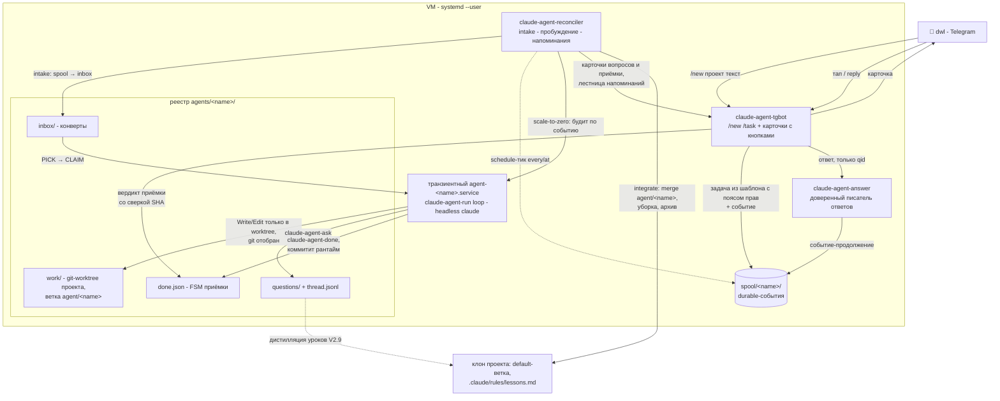

# Архитектура

> **Слой 1 переехал в бота (V3.0, 2026-08-01).** Сессии поднимаются тапом в Telegram
> (`/sessions` -> проект -> сессия по имени) и живут транзиентными юнитами
> `ccsession-<uuid>`; вечной control-сессии, её watchdog'а и tmux в схеме больше нет.
> Контракт - [design-2026-08-01-v3-layer1-sessions-on-bot.md](./design-2026-08-01-v3-layer1-sessions-on-bot.md).
> Разделы ниже про `claude-control-session`, `claude-control-watchdog`,
> `claude-control-project-watchdog` и `claude-control-run` описывают **legacy**-путь:
> файлы остались в репозитории для отката, установщик их больше не включает и снимает
> с уже установленных машин.

## Слой 1 сегодня

```text
Telegram /sessions ──► claude-rc sessions <p> --porcelain   (uuid, имя, live)
        │                        │
        │ тап по сессии          ▼
        └──────────────► claude-rc up <p> <uuid>
                                 │
                                 ▼
                 systemd-run --user --unit ccsession-<uuid>
                   --service-type=exec --property=KillMode=control-group
                   --property=MemoryMax=2G --working-directory=<cwd сессии>
                     └─► script -qec "claude --remote-control [--name <имя>]
                                       --resume <uuid> --debug-file <лог> -- <промпт>"
```

Три вещи, каждая из которых обязательна и ни одна не очевидна:

- **промпт** - `--resume` без него выходит с `No deferred tool marker` ВСЕГДА, а не только на прерванной сессии;
- **pty** (`script -qec`) - без tty процесс отрабатывает промпт как одноразовый запуск и завершается, к мосту не подключившись;
- **имя** - `--name` попадает в `custom-title` транскрипта, поэтому туда идёт собственное имя сессии, а безымянная поднимается вовсе без флага.

Глаголы CLI: `sessions <p> --porcelain`, `up <p> <uuid> [--prompt]`, `new <p>`, `down <uuid>`, `live`.

## Legacy-схема (до V3.0)

```
┌──────────────────┐         ┌──────────────────────────────┐
│  Claude mobile / │ ─────►  │  Anthropic remote-control    │
│  claude.ai/code  │         │  routing (claude.ai)         │
└──────────────────┘         └──────────────┬───────────────┘
                                            │
                                            ▼
                              ┌──────────────────────────────┐
                              │  Твой Mac / Linux-машина     │
                              │                              │
   супервизор (user-level)    │   ┌────────────────────────┐ │
   control unit              ─┼─► │ claude-control-session │ │
                              │   │  → claude remote-      │ │
                              │   │    control --name      │ │
                              │   │    control --capacity 1│ │
                              │   └────────────────────────┘ │
                              │                              │
   watchdog unit              │   ┌────────────────────────┐ │
   (раз в 5 минут)           ─┼─► │ claude-control-watchdog│ │
                              │   │  читает control.log,   │ │
                              │   │  при отсутствии        │ │
                              │   │  heartbeat'а пинает    │ │
                              │   │  супервизор            │ │
                              │   └────────────────────────┘ │
                              │                              │
                              │   когда ты говоришь          │
                              │   "подними X" в control:     │
                              │                              │
                              │   ┌────────────────────────┐ │
                              │   │ claude-rc X            │ │
                              │   │  → tmux new-session    │ │
                              │   │    cd $path && claude  │ │
                              │   │    remote-control      │ │
                              │   │    --name X            │ │
                              │   └────────────────────────┘ │
                              └──────────────────────────────┘
```

## Компоненты

> Первые четыре раздела - legacy-путь (см. врезку в начале файла). Актуальны
> `claude-rc` (в части `sessions/up/new/down/live`), `claude-control-logrotate` и
> весь агентный слой.

### `claude-control-session` (control) - legacy

Тонкая bash-обертка, которую супервизор держит живой. Внутри - `claude remote-control --name control --capacity 1`, запускается из `~/.claude-control/`. Эта папка для control-сессии - проектная директория, поэтому ее `CLAUDE.md` тоже подгружается как контекст. Назначение `CLAUDE.md` тут - научить control-сессию реагировать на "подними `<имя>`", "что запущено", "убей `<имя>`" соответствующими bash-командами и ничего больше в этой папке не делать.

`--capacity 1` потому что control-сессия одна и параллелизм ей не нужен.

### `claude-rc <project>`

Bash-скрипт. Ищет `<project>` в `~/.claude-control/projects.yaml` через `yq` (строго `mikefarah/yq` v4), проверяет существование пути, поднимает detached `tmux`-сессию `claude-<project>`, запуская в ней `claude-control-run` (launcher), который выполняет `claude remote-control --name <project>` в нужной директории и пишет вывод в лог проекта с первой строки. Режим `--spawn` определяет автоматически: `worktree`, если каталог - git-репозиторий, `same-dir` иначе. `status <project>` сверяет имя с `projects.yaml` и классифицирует состояние по последнему статусному событию в выводе. `stop <project>` (глагол "положи `<имя>`" с телефона) гасит сессию ЛОКАЛЬНО: шлет `SIGTERM` именно процессу `claude remote-control` (не панельному shell/`tee`, находит его через `pgrep -P <pane_pid> -f "remote-control --name <project>"`), чтобы claude чисто дренил под-сессии/MCP/worktree, ждет выхода до `CLAUDE_RC_STOP_GRACE` секунд (по умолчанию 15) и только если не вышел - добивает `tmux kill-session`. Это лучше голого `kill-session` (SIGHUP осиротит детей). **ВАЖНО:** `stop` НЕ убирает сессию из списка на телефоне - `claude remote-control` намеренно сохраняет environment для resume при любом локальном завершении (сигнал/клавиша/выход) и дерегистрирует его только после ~10 мин сетевого give-up или серверного таймаута (bridge-pointer TTL ~4ч). Поддерживаемого headless-способа убрать раньше нет (внутренний путь - `DELETE /v1/environments/bridge/{envId}` с OAuth-токеном CLI - осознанно не используем). Поэтому запись висит до ~4ч и уходит сама.

`last <project>` и `<project> --continue` дают resume. `last` показывает самую свежую восстановимую сессию, перечисляя транскрипты (`~/.claude/projects/<slug>/*.jsonl`) И проектного слага, И всех worktree-слагов `<slug>--claude-worktrees-*` - реальная работа часто уходит в спавненную worktree-сессию, чей транскрипт лежит под слагом ЕЕ каталога, а не проекта, - и помечает каждую тегом origin (`project`/`worktree`) плюс вердиктом `resumable`. `--continue` восстанавливает эту сессию одиночным продолжением: если свежайшая - проектная, это `--continue` в каталоге проекта; если worktree-сессия - `cd` в тот worktree и `--session-id <uuid>` (CLI запрещает совмещать `--continue`/`--session-id` со `--spawn`/`--capacity`, поэтому resume их не несет - это не диспетчер, а одиночное продолжение). Worktree-resume отказывает, если каталог worktree залочен (его может держать живая сессия) или вырезан. Обе команды только читают транскрипты; превью первого сообщения (строка с префиксом `|`) возвращается как недоверенные данные, как вывод `status`.

`sessions <project>` печатает то же перечисление как меню выбора при старте: строка `[0] fresh` плюс до 4 последних восстановимых сессий (индекс, возраст, origin, превью), с пометкой у worktree-строк, если восстановить нельзя (залочен/вырезан). `<project> --resume N` поднимает пункт N из этого меню - всегда явным `--session-id <uuid>` в каталоге той сессии (для worktree-пунктов те же гарды залочен/вырезан, что у `--continue`); индекс резолвится в конкретную сессию в момент вызова. Плайн `<project>` без опций по-прежнему всегда стартует свежую диспетчер-сессию - на этот путь завязан авто-рестарт зомби из `claude-control-project-watchdog`, поэтому меню он не показывает.

**Имя, под которым поднимается resume, - имя самой сессии, а не проекта.** Подключаясь к bridge, CLI записывает значение `--name` в `custom-title` транскрипта (проверено 2026-08-01 на подопытной сессии: `ПРОБА` -> `probe-name` ровно перед `agent-name` и `bridge-session`). Пока `claude-rc` передавал туда имя проекта из реестра, восстановление чужой сессии молча переименовывало ее (`сессия 1` -> `проект 1`) и уничтожало разметку истории, которую человек навел через `/rename`; в меню при этом появлялись несколько одинаковых `проект 1`, неотличимых друг от друга. Поэтому при `--resume`/`--continue` в `--name` уходит текущее название сессии (последняя запись `custom-title`, греп терпит и pretty-формат) - перезапись становится холостой, а в приложении видно название человека, а не имя проекта. Названия нет - имя проекта, как раньше: свежей сессии затирать нечего. Отсюда же снят пин `--name` в `stop`: процесс ищется среди детей панели по `remote-control`, потому что имя больше не предсказуемо (регрессия покрыта `tests/test-rc-session-title.sh`).

Если сессия с таким именем уже жива, скрипт делает no-op с сообщением, а не плодит дубль.

### `claude-control-watchdog` - legacy

Запускается каждые 2 минуты (на macOS - `StartInterval=120` в plist watchdog'а; на Linux - `.timer` с `OnUnitActiveSec=2min`). Основной сигнал живости - `--debug-file` control-сессии: клиент пишет туда heartbeat по таймеру каждые ~20с (`CCRClient: Heartbeat sent` при успехе, `CCRClient: Heartbeat failed: ...` при сбое), без backoff. Пока heartbeat капает, mtime файла свежий - живая сессия (здоровая или ретраящая сеть после 403/обрыва) освежает его ~каждые 20с. Если mtime старше `STALE_SECONDS` (по умолчанию 150с, ~7 пропущенных ударов), таймер heartbeat встал = зомби ("zombie-Connected": TUI еще рисует "Connected", а фоновый цикл мертв). Один промах не вызывает рестарт: watchdog считает подряд пропущенные тики (`.watchdog-misses`) и пинает супервизор только после нескольких промахов подряд (по умолчанию 2), чтобы единичный сетевой blip не дергал control-сессию зря. Если `--debug-file` еще нет (старая или только что перезапущенная сессия) - fallback на прежний способ: ищет имя сессии (`control` по умолчанию) как whitespace-bounded token в хвосте `control.log`. Каждый тик watchdog также вызывает `claude-control-logrotate`.

Зачем это нужно: процесс `claude remote-control` может оставаться живым, при этом **зарегистрированная сессия** на стороне Anthropic-роутинга может исчезнуть (capacity падает до 0). Супервизор этого не видит - процесс-то жив; на телефоне же сессия `control` пропадает. Watchdog ловит это по логу и пинает процесс.

### `claude-control-project-watchdog` - legacy

То же самое, но для **проектных** сессий, которые запускает `claude-rc`. У них, в отличие от control, нет ни супервизора (KeepAlive), ни своего watchdog'а: сессия живет в detached tmux-окне `claude-<project>` и после 403-флапа (обрыв VPN, сон/пробуждение) зомбируется - TUI рисует "Ready / Capacity 0/5", а поллинг мертв. Проект молча "пропадает" с телефона на простое.

Запускается каждые 2 минуты (macOS - `StartInterval=120`; Linux - `.timer` с `OnUnitActiveSec=2min`). Надзирает **ровно за теми проектами, у кого сейчас есть живое tmux-окно**: сессию, которую пользователь остановил сам, воскрешать не надо (ее окно закрыто), а зомби окно сохраняет. Сигнал живости переиспользован у control-watchdog'а: `claude-rc` теперь запускает проектные сессии с `--debug-file`, так что у каждой есть тот же heartbeat. Свежий mtime debug-файла = жива (в т.ч. ретраит сеть - `Heartbeat failed` тоже капает каждые ~20с, флап не трогаем); молчание дольше `STALE_SECONDS` (150с) = зомби. Для сессий без debug-файла (запущены до инструментации) - fallback на mtime TUI-лога, но этот сигнал НЕ отличает здоровый простой (сессия просто перестала перерисовываться) от смерти, поэтому на fallback watchdog **только логирует, никогда не рестартит** (даже armed). Чтобы взять такую сессию под реальный надзор - один раз перезапустить ее через `claude-rc`, она получит `--debug-file`. После `MISS_THRESHOLD` промахов подряд (2), только если armed (`CLAUDE_CONTROL_PROJECT_WATCHDOG_ARM=1`, дефолт) И вердикт по heartbeat (не fallback) - убивает зависшее окно и перезапускает через `claude-rc` (новая сессия снова получает свой `--debug-file`). Для калибровки нового детектора по реальному трафику можно поставить `ARM=0` - тогда вместо kill+relaunch только пишет "WOULD restart" в `project-watchdog.log`.

Вне охвата: смерти, которые сносят и tmux-окно (жесткий краш, ребут, убивший tmux-сервер) - живого окна, за которое можно зацепиться, не остается.

### `claude-control-run` (legacy) и `claude-control-logrotate`

`claude-control-run` - тонкий launcher проектной сессии: пишет лог с первого байта (без гонки `new-session` -> `pipe-pane`) и сохраняет код возврата `claude` (не маскируется `tee`). Параметры получает через `tmux -e` (env, без shell-парсинга - безопасно для путей с пробелами/кавычками), на старом tmux - позиционными аргументами. Если передан `CCR_DEBUG` (его ставит `claude-rc`), добавляет `--debug-file` - heartbeat-сигнал для `claude-control-project-watchdog`.

`claude-control-logrotate` - ротация всех логов (`control.log/.err`, `watchdog.*`, `project-watchdog.log`, `sessions/*.log` и их `*.debug.log`) по размеру. Вызывается watchdog'ом каждый тик, `claude-rc` на старте и отдельным таймером (независимо от `--watchdog`), так что логи ограничены даже без watchdog'а.

## Агентный слой (Linux only)

Поверх проектных сессий живет слой **автономных агентов**: миссии, которые работают без человека под надзором reconciler'а. Полный контракт (state machine, lease/fencing, crash-матрица) - в `docs/design-2026-07-11-agent-state-machine.md`; здесь - карта компонентов.

- **`claude-rc agent <verb>`** (диспатчится в `claude-rc-agent`) - операторский CLI: `create/start/pause/stop/status/list/resolve/revise/accept/reject/attach`. Реестр - `~/.claude-control/agents/<name>/` (spec.yaml, mission.md, control.json, state.<gen>.json, events.jsonl, agent-settings.json, work/ - приватный git-worktree агента). `create` фиксирует `mission_base`, создает ветку `agent/<name>` и атомарен: реестр И worktree собираются в staging-каталоге и публикуются единым `mv` (крэш до публикации не оставляет полуагента). Per-agent permissions генерятся там же в `agent-settings.json` по пресету autonomy (act/release = полный Bash + чтение реестра; suggest = минимальные руки; bypassPermissions никогда) - в worktree настройки НЕ сеются, их подхватывает рантайм флагом `--settings` (см. `claude-agent-session`). Stale-scratch прежней одноименной инкарнации (flags-кэш реконсилера, spool, alerts-state) чистится под fcntl-локами, общими с reconciler'ом/продюсером.
- **`claude-agent-io`** (python3) - единственный писатель `control.json`: durable-write (tmp -> fsync -> rename -> fsync каталога), CAS под flock с монотонным `seq`, schema-валидация при чтении, фенсинг поколений через `state.<gen>.json`, чистая классификация состояния.
- **`claude-agent-reconciler`** - демон (`--loop`, systemd-юнит) или одиночный проход (`--once`): сводит факт (systemd-юниты, state, relay-heartbeat из `session.debug.log`) к desired. Lease-протокол с CAS-гейтами A/B; гашение по инварианту "lease освобождается только при доказанно пустом cgroup"; admission по RAM-бюджету (`CLAUDE_AGENTS_RAM_BUDGET_MB`, дефолт 2500) с одним стартом за проход; fail-closed hold при запертом `/data` (`CLAUDE_AGENTS_REQUIRE_MOUNT`); alert-леджер `reconciler/alerts.jsonl` с дедупом эпизодов (пуш-канал - hook `CLAUDE_AGENT_ALERT_CMD`, TG-бот - этап 3).
- **`claude-agent-session`** - обертка рантайма одного поколения (MainPID транзиентного `agent-<name>.service`, Type=exec, KillMode=control-group, MemoryMax из spec): пресидит trust/onboarding в `$CLAUDE_CONFIG_DIR/.claude.json`, держит tmux-клиент форграундом на per-generation сокете `agent-<name>.g<gen>` (внутри - `claude remote-control --name agent-<name>`). Права сессии задает сама: `--settings <реестр>/agent-settings.json` + `--setting-sources user` (без project и local - `.claude/` целевого репо не расширяет права агента молча) + `--permission-mode` по autonomy (act/release -> acceptEdits, suggest -> default). Fail-safe: нет `agent-settings.json` (крэш при create, старый агент) -> деградация к `--permission-mode default` (подтверждения оператора), а НЕ полные права. Attach: `claude-rc agent attach <name>`.
- **`claude-agent-checkrun`** - bounded-воркер приемки: гоняет детерминированный `acceptance.check` дважды в worktree артефакта, результат собирает reconciler следующими проходами (fencing по `{job_id, generation, artifact}`).
- **`claude-agent-review`** (python3, этап 7) - bounded-воркер LLM-приёмки с независимым контекстом: судит артефакт mission-агента ТОЛЬКО по `git diff <gen_base>..<artifact>` (в промпте), из пустого приватного cwd, все инструменты запрещены (в т.ч. Read/Glob), reviewer-role проверяется по manifest-sha в рантайме. Строгий парсер вердикта (ровно один валидный JSON, инъекция вторым блоком/accept+blocker -> uncertain), результат durable no-clobber (O_EXCL+link, first-result-wins). Режим приёмки задаётся `acceptance.kind` в spec: `deterministic` (как §8.2), `role-review` (только приёмщик), `both` (детерминированный чек-гейт -> приёмщик). Асимметрия вердикта: auto-accept - опт-ин `auto_accept:true`; reject/uncertain всегда -> needs-human (false-reject не убивает годную работу). Reconciler ведёт phase-FSM both, tuple-fencing {job_id,generation,artifact}, retry с attempts, revoke роли (`claude-rc agent revoke-role`) - durable CAS-поле. Роль приёмщика - замороженный снапшот `reviewer-role/` (manifest+sha). Контракт - `docs/design-2026-07-12-stage7-acceptor-role.md`.
- **`claude-agent-tgbot`** - TG-дашборд: long-poll getUpdates через mihomo-прокси (webhook и прямой API режутся ТСПУ); auth = private chat + from.id whitelist (группа правом не является); `/agents`, `/agent <name>` (имя валидируется до обращения к ФС, вывод агентов эскейпится как недоверенный), `/new <проект> <текст>` (рождение задачи из шаблона, V2.7a), `/task <name> <текст>` - продюсер событий в spool (идемпотентность по update_id, transient-отказ не двигает offset), `/menu`, `/limits`; карточки вопросов и приёмки с inline-кнопками (V2.5) - тап/reply валидируется и уходит ТОЛЬКО через доверенных писателей (`claude-agent-answer`, вердикт приёмки со сверкой SHA карточки), бот сам состояние не пишет; режим `send` = хук `CLAUDE_AGENT_ALERT_CMD` для пушей reconciler'а (дедуп эпизодов - на стороне alert-леджера). Токен/whitelist - в `~/.config/claude-control/env`. Офлайн-тесты: `claude-agent-tgbot selftest`.
- **`claude-agent-run`** (python3, этап 4) - событийный слой поверх того же реестра (`type: event` в spec): `spool-put` - producer-протокол durable spool-каталога `~/.claude-control/spool/<name>/` (crash-safe seq-резерв, идемпотентность `--id`, капы с backpressure); `intake` - contiguous-курсор spool -> pending-конверты inbox (зовется каждым проходом reconciler'а, работает и при paused/hold); `loop` - executor (MainPID leased-юнита): PICK -> CLAIM -> headless `claude -p` -> дедуп-леджер -> done (дефолт этапа 4 - deny-by-default инструменты в пустом приватном cwd; task-агенты V2 - worktree проекта и пояс прав из спеки, см. следующий пункт); ретраи 1/5/15 мин, инфра-гейт с auth-сниффом (протухший логин не гонит события в DLQ), 3 попытки -> deadletter, recovery мертвых runner'ов, карантин crash-loop'ящих конвертов; бюджет = durable капы прогонов день/неделя, кап -> exit + hold `budget_exhausted` (intake живет). Операторские глаголы: `claude-rc agent dlq <name> [--requeue|--drop]`, `inbox-restore`. Контракт - `docs/design-2026-07-12-stage4-event-spool.md` (7 adversarial-раундов codex).
- **Контур задач V2** (V2.0-V2.10, дизайны `docs/design-2026-07-25-v2-runtime-drain.md` ... `docs/design-2026-07-28-v2.10-task-actually-works.md`) - жизненный цикл "/new с телефона" поверх event-слоя. `runtime: drain` - executor гаснет на пустом inbox, reconciler будит по событию (scale-to-zero); `workspace: worktree` - задача работает в `agents/<name>/work`, git-worktree проекта на ветке `agent/<name>`; пояс прав из task-шаблона (`~/.claude-control/task-template.yaml`, fail-closed: нет валидного шаблона - задача не заводится; Write/Edit скоуплены путём worktree); тред-память `thread.jsonl` переживает прогоны; вопрос - durable-исход прогона (`claude-agent-ask` -> `questions/`, ответ пишет только доверенный `claude-agent-answer`), гейт подтверждений `claude-agent-permit` (PreToolUse-hook) - тот же FSM; пуши карточек и лестница напоминаний целиком у reminder-контура reconciler'а (единственный владелец). Заявка о готовности `claude-agent-done` + durable acceptance-FSM `requested -> accepted -> integrated -> cleaned -> archived` (`claude-rc agent accept/reject` с машины или тап на карточке; integrate игнорирует грязь, ограниченную зеркалом уроков). `spec.schedule` (`every`/`at`) - источник событий без новых юнитов; поправки человека дистиллируются в правила проекта (V2.9). **Git у агента отобран целиком** (V2.10: хуки, флаги вроде `git log --output=`, clean-фильтры, fsmonitor - три независимых способа исполнить код агента до приёмки); все git-операции идут единственной чищеной точкой входа `_agent_worktree.py` (`GIT_CONFIG_NOSYSTEM`, обнулённые hooksPath/fsmonitor, guard-отказ на clean-фильтры и подмену gitdir), коммитит рантайм после заявки.

Контур задач V2 одной схемой - от `/new` с телефона до merge в проект:



Агентские сессии **вне охвата** `claude-control-project-watchdog` (живут на своих tmux-сокетах и не числятся в projects.yaml; в watchdog есть и явный guard) - их надзирает только reconciler: политика "stale -> stop + fresh" уничтожила бы миссию.

Тесты: `tests/test-agent-*.sh` - юнит-суиты по компонентам (io, cli, run, review, tgbot, canon-maintainer; V2-контур: drain, workspace, thread, question, permit, tg-cards, reminders, task-lifecycle, schedule, lessons), `tests/test-mission-*.sh` (юнит, локально), `tests/fault/run-fault-tests.sh` (fault-injection: crash-матрица + событийные S16-S19 + приёмщик S20-S27, Linux/systemd, mock-агент/mock-CLAUDE_BIN), `tests/corpus/run-corpus.sh` (LLM-корпус приёмщика, требует API - критерий этапа 7).

## Супервизоры

### macOS (launchd)

- `~/Library/LaunchAgents/com.<user>.claude-control.plist` - control-сессия, `KeepAlive=true`, `ThrottleInterval=30`. Перезапуск - `launchctl kickstart -k gui/$UID/<label>`.
- `~/Library/LaunchAgents/com.<user>.claude-control-watchdog.plist` - watchdog control-сессии, `StartInterval=120`, `RunAtLoad=true`.
- `~/Library/LaunchAgents/com.<user>.claude-control-project-watchdog.plist` - watchdog проектных сессий, `StartInterval=120`, `RunAtLoad=true`. Ставится вместе с control-watchdog'ом (тем же `--watchdog`), `ARM=1` (auto-restart; 0 = observe-only).
- `~/Library/LaunchAgents/com.<user>.claude-control-logrotate.plist` - ротация логов, `StartInterval=3600`. Ставится независимо от `--watchdog`.

### Linux (systemd --user)

- `~/.config/systemd/user/claude-control.service` - control-сессия, `Restart=always`, `RestartSec=30`. Перезапуск - `systemctl --user restart claude-control.service`.
- `~/.config/systemd/user/claude-control-watchdog.service` - oneshot (watchdog control-сессии).
- `~/.config/systemd/user/claude-control-watchdog.timer` - триггер: `OnActiveSec=2min` (первый запуск) + `OnUnitActiveSec=2min` (последующие). `Persistent=false` - watchdog это health-probe, а не задание, упущенные тики ловить не нужно.
- `~/.config/systemd/user/claude-control-project-watchdog.{service,timer}` - watchdog проектных сессий, тот же интервал 2min. Ставится вместе с control-watchdog'ом (`--watchdog`), `ARM=1` (auto-restart; 0 = observe-only).
- `~/.config/systemd/user/claude-control-logrotate.{service,timer}` - ротация логов, `OnUnitActiveSec=1h`. Ставится независимо от `--watchdog`, поэтому логи ограничены и при `--no-watchdog`.
- `~/.config/systemd/user/claude-agent-reconciler.service` - reconciler агентного слоя, `Restart=always`, `RestartSec=30`. Ставится безусловно (при пустом реестре - холостой цикл). Рантаймы агентов - транзиентные `agent-<name>.service` через `systemd-run`, юнит-файлов у них нет.
- `~/.config/systemd/user/claude-agent-tgbot.service` - TG-дашборд, `Restart=on-failure` (без токена выходит с кодом 0 и не рестартится; install.sh включает юнит только при настроенном `CLAUDE_AGENT_TG_TOKEN`).

Без `loginctl enable-linger $USER` user-сервисы остановятся при logout. `install.sh` проверяет и предупреждает, если lingering выключен.

Опционально: `~/.config/claude-control/env` подхватывается обоими unit'ами через `EnvironmentFile=-` (отсутствие файла - не ошибка). На macOS launchd env-файлы не читает, поэтому тот же файл читает сам entrypoint `claude-control-session` - на macOS это влияет на control-сессию (`CLAUDE_BIN`, proxy), но не на watchdog/logrotate. Удобно для проброса `CLAUDE_BIN`, proxy-переменных и т.п. без правки unit'а.

## Что где лежит после установки

### macOS

```
~/.local/bin/
  claude-rc                       # скрипт (или симлинк на репо при --link)
  claude-control-run              # launcher проектной сессии (лог с первого байта)
  claude-control-logrotate        # ротация всех логов
  claude-control-session          # launchd entrypoint
  claude-control-watchdog         # скрипт watchdog'а

~/Library/LaunchAgents/
  com.<user>.claude-control.plist             # control-сессия
  com.<user>.claude-control-watchdog.plist    # watchdog (раз в 5 минут)
  com.<user>.claude-control-logrotate.plist   # ротация логов (раз в час)

~/.claude-control/
  projects.yaml                   # твой реестр (в .gitignore репо)
  CLAUDE.md                       # контекст control-сессии
  .claude/settings.local.json     # allow-list bash-команд
  control.log, control.err        # stdout/stderr control-сессии
  watchdog.log                    # история kickstart'ов watchdog'а
  watchdog.out, watchdog.err      # stdout/stderr watchdog'а
  .watchdog-misses                # счетчик подряд пропущенных heartbeat (служебный)
```

### Linux

```
~/.local/bin/
  claude-rc, claude-control-run, claude-control-logrotate
  claude-control-session, claude-control-watchdog

~/.config/systemd/user/
  claude-control.service
  claude-control-watchdog.service
  claude-control-watchdog.timer
  claude-control-logrotate.service
  claude-control-logrotate.timer

~/.config/claude-control/env      # опционально, env-переменные для unit'ов

~/.claude-control/
  projects.yaml, CLAUDE.md, .claude/settings.local.json
  task-template.yaml              # шаблон задачи /new (пояс прав; fail-closed, мигрируется install.sh)
  control.log, control.err
  agents/<name>/                  # реестр автономных агентов (spec.yaml, control.json, agent-settings.json,
                                  #   inbox/, questions/, thread.jsonl, done.json, work/ - worktree задачи)
  spool/<name>/                   # durable spool событийных агентов (продюсеры пишут через spool-put)
  reconciler/                     # scratch реконсилера (alerts.jsonl, cache/<name>.flags)
  watchdog.log, watchdog.out, watchdog.err
```
